# InventoryIQ

## Enterprise Inventory Optimization Platform

InventoryIQ is a cloud-based inventory analytics platform that helps users explore inventory performance, sales trends, supplier reliability, and operational risk through interactive dashboards.

The platform models a single-distribution-center inventory environment and uses **Amazon S3, Amazon Athena, SQL, Python, Pandas, Plotly, and Streamlit** to transform warehouse data into business insights.

**Developed by Sandeep Senthil**

---

## Live Application

[Open InventoryIQ Dashboard](https://inventoryiq-sandeep-senthil.streamlit.app)

---

## Project Preview

<p align="center">
  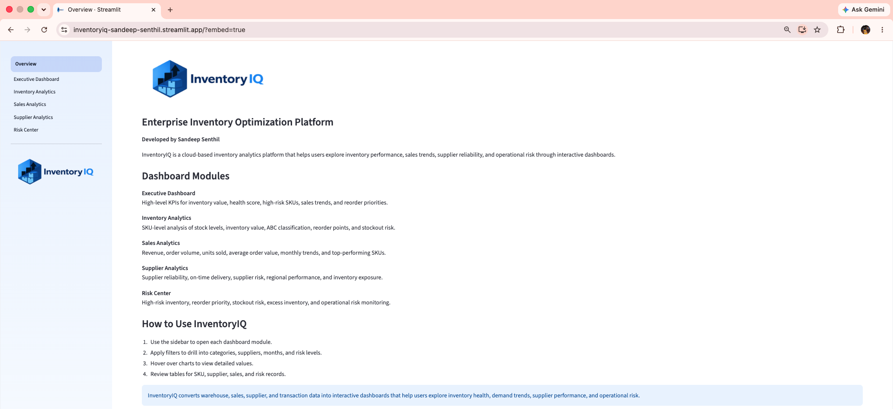
</p>

---

## Project Objective

The goal of InventoryIQ is to demonstrate how cloud analytics can support modern inventory management. The application centralizes warehouse, inventory, sales, supplier, purchase order, and transaction data into an interactive business intelligence platform.

InventoryIQ helps users answer questions such as:

- Which inventory categories hold the most value?
- Which SKUs have the highest stockout risk?
- Which suppliers create the most inventory exposure?
- Which product categories drive the most revenue?
- Which items should be prioritized for reorder?
- Where are the biggest operational risks?

This project was built to demonstrate practical skills in cloud analytics, SQL, Python data processing, inventory optimization, dashboard development, and end-to-end product deployment.

---

## Architecture Overview

InventoryIQ follows a modern cloud analytics workflow:

```text
Raw Warehouse Data
        ↓
Data Cleaning and Feature Engineering
        ↓
Amazon S3 Data Lake
        ↓
Amazon Athena SQL Query Layer
        ↓
Python Analytics Engine
        ↓
Streamlit Dashboard Application
        ↓
Executive Decision Support
```

<p align="center">
  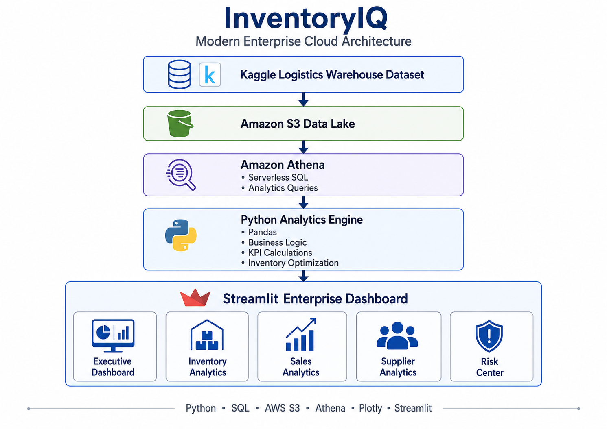
</p>

---

## Cloud Architecture

InventoryIQ uses Amazon S3 as the cloud data lake and Amazon Athena as the serverless SQL query layer. Python and Pandas handle business logic, KPI calculations, and dashboard data preparation. Streamlit provides the interactive application layer.

<p align="center">
  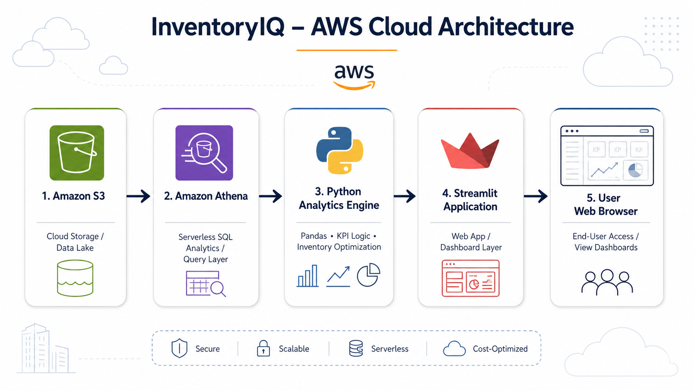
</p>

---

## Data Flow

The platform converts raw warehouse data into cleaned datasets, queryable tables, calculated KPIs, and interactive dashboards.

<p align="center">
  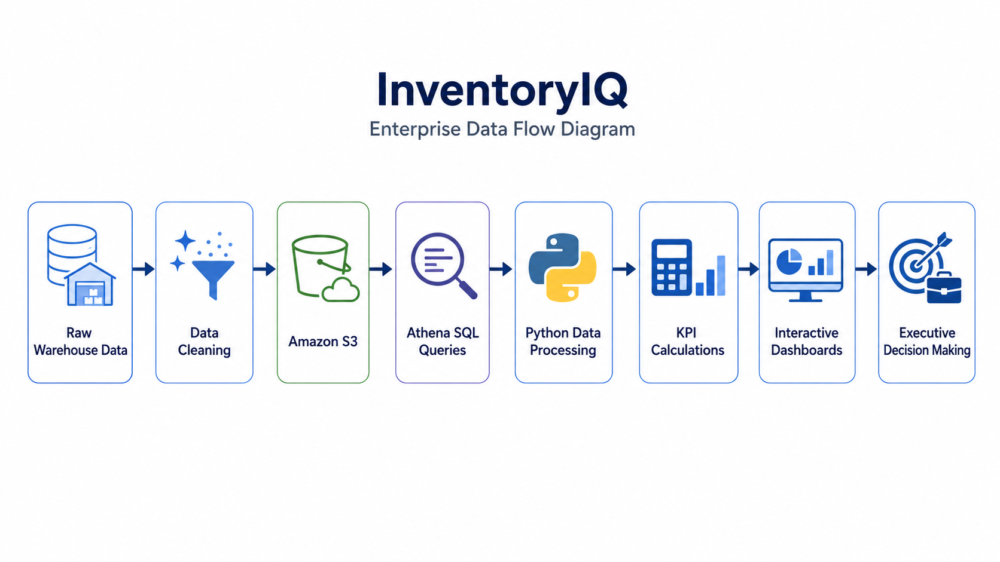
</p>

---

## Business Process Flow

InventoryIQ models an inventory optimization workflow from customer orders to inventory updates, stockout risk evaluation, reorder recommendations, supplier performance review, and executive dashboard reporting.

<p align="center">
  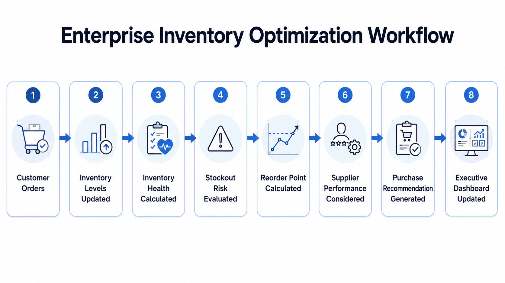
</p>

---

## Dashboard Overview

InventoryIQ includes five dashboard modules:

1. Executive Dashboard
2. Inventory Analytics
3. Sales Analytics
4. Supplier Analytics
5. Risk Center

<p align="center">
  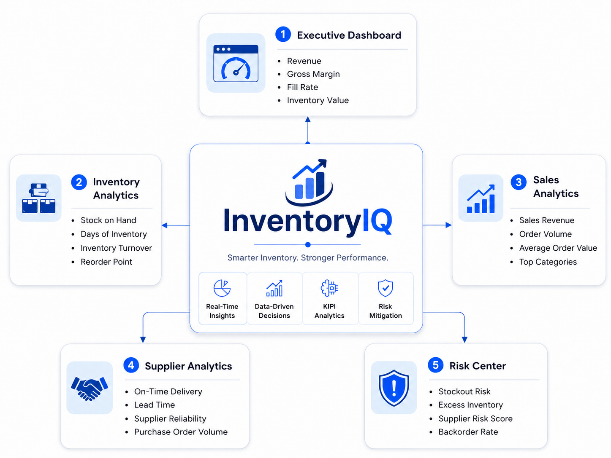
</p>

---

## Dashboard Modules

### Executive Dashboard

The Executive Dashboard provides a high-level view of inventory performance, sales performance, risk exposure, and warehouse activity.

Key views include:

- Total SKUs
- Total inventory value
- Average health score
- High-risk SKUs
- Reorder quantity
- Inventory value by category
- Sales revenue by category
- Monthly sales trend
- Warehouse transaction activity

<p align="center">
  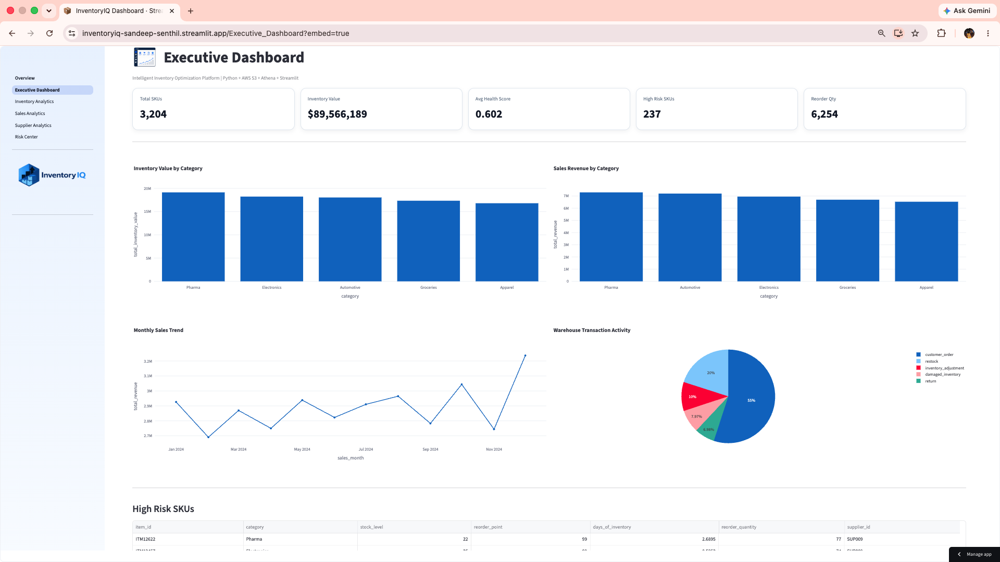
</p>

---

### Inventory Analytics

The Inventory Analytics page helps users analyze SKU-level inventory performance across categories, suppliers, stockout risk levels, and inventory value.

Key views include:

- Filtered SKU count
- Inventory value
- Average stock level
- Average days of inventory
- Inventory value by category
- SKU count by stockout risk
- ABC classification
- Stock level distribution
- Highest-value inventory table
- SKU-level inventory explorer

<p align="center">
  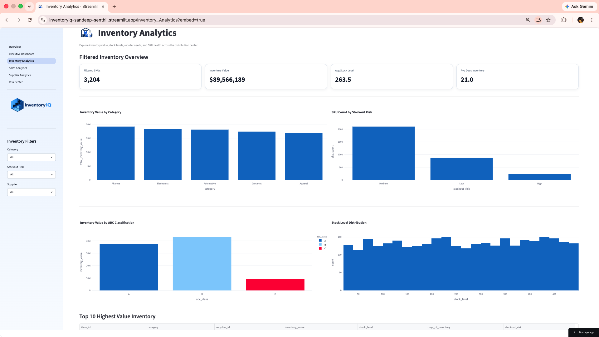
</p>

---

### Sales Analytics

The Sales Analytics page helps users evaluate revenue performance, monthly demand trends, supplier sales contribution, and top revenue SKUs.

Key views include:

- Revenue
- Orders
- Units sold
- Average order value
- Revenue by category
- Monthly revenue trend
- Top revenue SKUs
- Revenue by supplier
- Sales order explorer

<p align="center">
  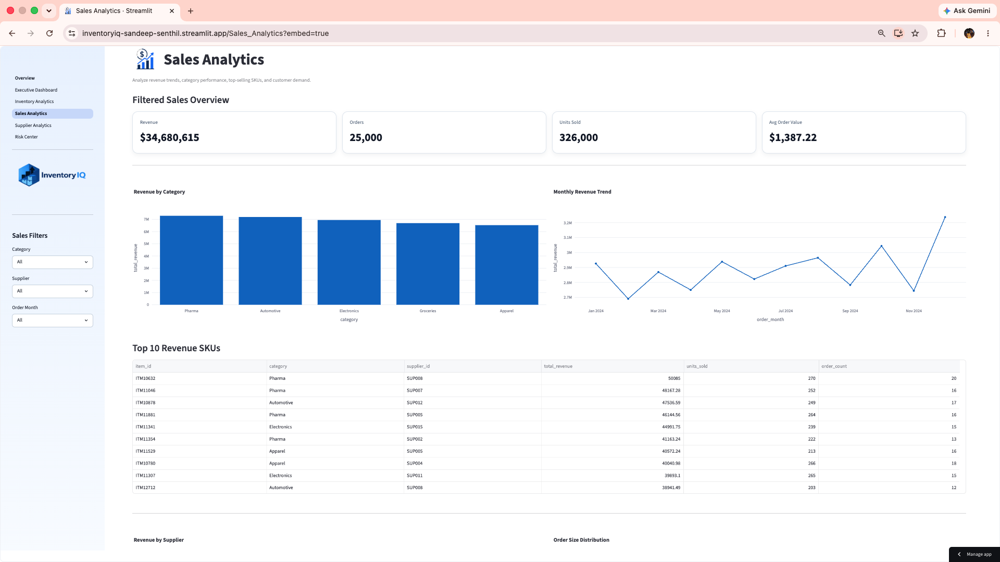
</p>

---

### Supplier Analytics

The Supplier Analytics page evaluates supplier reliability, on-time delivery, supplier risk, inventory exposure, and regional supplier performance.

Key views include:

- Supplier count
- Average reliability
- On-time delivery rate
- Inventory value supplied
- Inventory value by supplier
- Supplier reliability score
- Supplier risk breakdown
- Inventory value by supplier region
- Supplier performance table

<p align="center">
  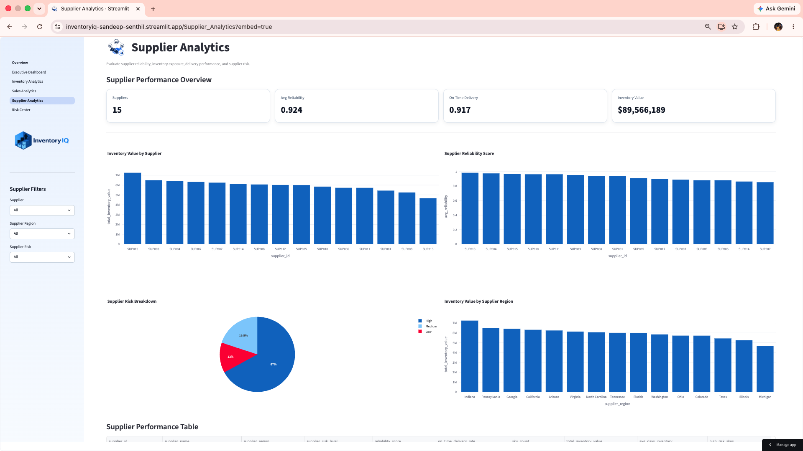
</p>

---

### Risk Center

The Risk Center helps users monitor operational risk across stockout risk, reorder needs, slow-moving SKUs, excess inventory, and supplier risk exposure.

Key views include:

- High-risk SKUs
- Reorder quantity
- Slow-moving SKUs
- Excess inventory SKUs
- Stockout risk by category
- Supplier risk exposure
- Reorder quantity by category
- Slow-moving SKUs by category
- Urgent reorder watchlist
- Risk detail explorer

<p align="center">
  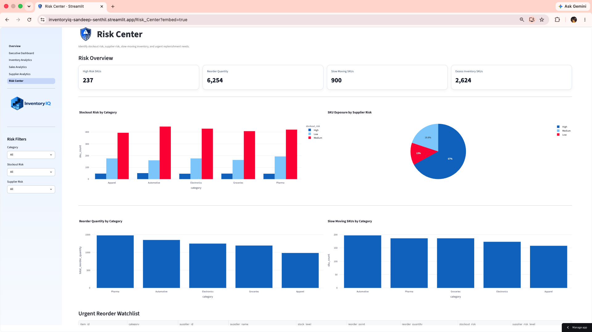
</p>

---

## Dataset

InventoryIQ uses the Kaggle Logistics Warehouse Dataset as the base warehouse dataset.

Dataset source:

[Logistics Warehouse Dataset on Kaggle](https://www.kaggle.com/datasets/ziya07/logistics-warehouse-dataset)

The original dataset was adapted into a larger inventory analytics environment by creating additional business tables for suppliers, purchase orders, sales orders, and warehouse transactions.

---

## Data Model

InventoryIQ uses five core datasets:

| Dataset | Purpose |
|---|---|
| `inventory_data_cleaning.csv` | SKU-level inventory records, stock levels, demand metrics, reorder points, and calculated inventory KPIs |
| `suppliers_data.csv` | Supplier IDs, regions, reliability scores, delivery performance, and supplier risk levels |
| `purchase_orders.csv` | Purchase order activity, order quantities, delivery dates, supplier replenishment, and purchasing cost data |
| `sales_orders.csv` | Customer order demand, revenue, units sold, and monthly sales activity |
| `inventory_transactions.csv` | Warehouse activity including customer orders, restocks, returns, damaged inventory, and inventory adjustments |

---

## Key Business Metrics

InventoryIQ calculates and visualizes inventory, sales, supplier, and operational risk KPIs.

### Inventory Metrics

- Inventory value
- Days of inventory
- Inventory coverage days
- Stockout risk
- Reorder quantity
- Safety stock
- ABC classification
- Slow-moving inventory
- Excess inventory
- Demand growth

### Sales Metrics

- Sales revenue
- Units sold
- Order count
- Average order value
- Monthly revenue trend
- Top revenue SKUs
- Revenue by category
- Revenue by supplier

### Supplier Metrics

- Supplier reliability
- On-time delivery rate
- Supplier risk level
- Inventory value by supplier
- Inventory value by supplier region
- High-risk SKU exposure by supplier

### Risk Metrics

- High-risk SKUs
- Urgent reorder quantity
- Slow-moving SKUs
- Excess inventory SKUs
- Stockout risk by category
- Supplier risk exposure

---

## SQL Analytics Layer

Amazon Athena is used as the serverless SQL query layer over inventory data stored in Amazon S3.

The project includes SQL queries for:

- Executive KPIs
- Inventory value by category
- Inventory health by category
- Sales revenue by category
- Monthly sales trend
- Supplier performance
- High-risk SKUs
- Reorder recommendations
- ABC classification
- Top revenue SKUs
- Slow-moving inventory
- Transaction activity

SQL files are stored in:

```text
athena_queries/
```

---

## Technology Stack

| Area | Technology |
|---|---|
| Cloud Storage | Amazon S3 |
| Query Engine | Amazon Athena |
| Programming | Python |
| Data Processing | Pandas |
| Visualization | Plotly |
| Dashboard Application | Streamlit |
| Version Control | Git and GitHub |
| Development Environment | VS Code |
| Deployment | Streamlit Community Cloud |

---

## Repository Structure

```text
InventoryIQ/
│
├── athena_queries/
│   ├── abc_classification_athena.sql
│   ├── executive_kpis_athena.sql
│   ├── high_risk_skus_athena.sql
│   ├── inventory_health_by_category_athena.sql
│   ├── inventory_value_by_category_athena.sql
│   ├── monthly_sales_trend_athena.sql
│   ├── reorder_recommendations_athena.sql
│   ├── sales_revenue_by_category_athena.sql
│   ├── slow_moving_inventory_athena.sql
│   ├── supplier_performance_athena.sql
│   ├── top_revenue_skus_athena.sql
│   └── transaction_activity_athena.sql
│
├── dashboard/
│   ├── app.py
│   ├── requirements.txt
│   ├── assets/
│   ├── components/
│   ├── pages/
│   ├── styles/
│   └── utils/
│
├── data/
│   ├── inventory_data_cleaning.csv
│   ├── inventory_iq_raw_data.csv
│   ├── inventory_transactions.csv
│   ├── purchase_orders.csv
│   ├── sales_orders.csv
│   └── suppliers_data.csv
│
├── docs/
│   ├── Architecture/
│   │   ├── Business_Process_Flow_Diagram.png
│   │   ├── Cloud_Architecture_Diagram.png
│   │   ├── Dashboard_Overview_Diagram.png
│   │   ├── InventoryIQ_Data_Flow_Diagram.png
│   │   └── InventoryIQ_Enterprise_Architecture_Diagram.png
│   │
│   ├── Documentation/
│   │
│   └── Screenshots/
│       ├── overview_page_screenshot.png
│       ├── exec_dashboard_screenshot.png
│       ├── analytics_page_screenshot.png
│       ├── sales_analytics_page_screenshot.png
│       ├── suppliers_analytics_page_screenshot.png
│       └── risk_center_page_screenshot.png
│
├── excel/
├── images/
├── python/
├── sql/
├── .gitignore
└── README.md
```

---

## How to Run Locally

### 1. Clone the repository

```bash
git clone https://github.com/senthilsandeep2005/inventoryiq.git
cd inventoryiq
```

### 2. Create and activate a virtual environment

```bash
python3 -m venv .venv
source .venv/bin/activate
```

### 3. Install dependencies

```bash
pip install -r dashboard/requirements.txt
```

### 4. Configure AWS credentials

The app requires AWS credentials with access to Amazon Athena and the S3 query output location.

For Streamlit Cloud, configure secrets using:

```toml
AWS_ACCESS_KEY_ID = "your_access_key_id"
AWS_SECRET_ACCESS_KEY = "your_secret_access_key"
AWS_DEFAULT_REGION = "us-east-1"
```

### 5. Run the Streamlit application

```bash
streamlit run dashboard/app.py
```

---

## Phase 1 Status

InventoryIQ Phase 1 is complete.

Completed in Phase 1:

- Cleaned and engineered warehouse inventory dataset
- Created supplier, sales order, purchase order, and transaction datasets
- Uploaded data to Amazon S3
- Built Amazon Athena SQL query layer
- Developed Python and Pandas analytics logic
- Created five interactive Streamlit dashboard modules
- Added filters, KPI cards, charts, and data tables
- Deployed public Streamlit application
- Added professional branding, icons, and dashboard screenshots
- Documented cloud architecture, data flow, and business workflow

---

## Future Enhancements

Planned future improvements include:

- Automated data refresh pipeline
- Scheduled data ingestion
- Forecasting model for demand prediction
- Inventory alert system
- User authentication
- Role-based access control
- PDF executive reports
- CI/CD deployment workflow
- Additional AWS services such as Lambda or Glue
- Cost and performance optimization for Athena queries

---

## Skills Demonstrated

This project demonstrates practical experience with:

- Cloud data architecture
- AWS S3 and Athena
- SQL analytics
- Python data processing
- Pandas feature engineering
- Business intelligence dashboard design
- Inventory optimization logic
- Supplier performance analytics
- Sales analytics
- Risk monitoring
- Streamlit application development
- GitHub project documentation
- End-to-end product deployment

---

## Author

**Sandeep Senthil**

InventoryIQ was developed as a portfolio project to demonstrate cloud analytics, business intelligence, inventory optimization, and dashboard application development using AWS, SQL, Python, Pandas, Plotly, and Streamlit.